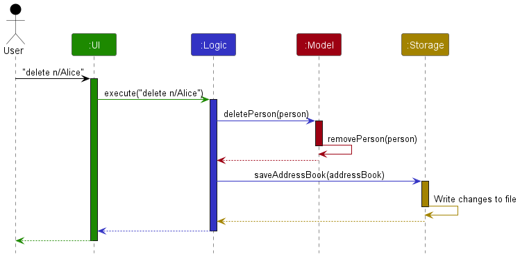
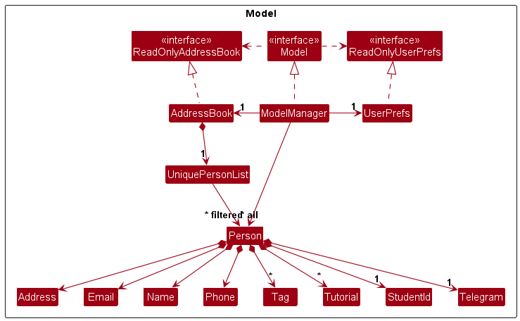
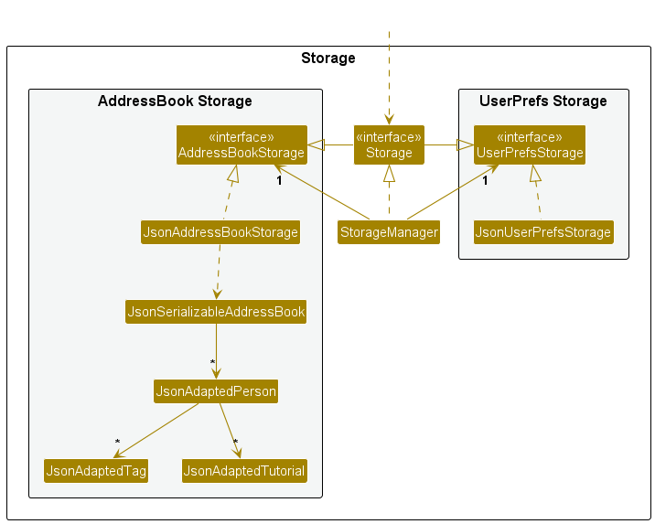

* Table of Contents
{:toc}

--------------------------------------------------------------------------------------------------------------------

## **Acknowledgements**

* The features add, list, edit, find, delete, clear and exit (including the code) was reused with 
changes made from [AB3](https://github.com/se-edu/addressbook-level3).

--------------------------------------------------------------------------------------------------------------------

## **Setting up, getting started**

Refer to the guide [_Setting up and getting started_](SettingUp.md).

--------------------------------------------------------------------------------------------------------------------

## **Design**

<div markdown="span" class="alert alert-primary">

:bulb: **Tip:** The `.puml` files used to create diagrams in this document `docs/diagrams` folder. Refer to the [_PlantUML Tutorial_ at se-edu/guides](https://se-education.org/guides/tutorials/plantUml.html) to learn how to create and edit diagrams.
</div>

### Architecture


The ***Architecture Diagram*** given above explains the high-level design of the App.

Given below is a quick overview of main components and how they interact with each other.

**Main components of the architecture**

**`Main`** (consisting of classes [`Main`](https://github.com/AY2425S2-CS2103T-F14-1/tp/blob/master/src/main/java/seedu/address/Main.java) and [`MainApp`](https://github.com/AY2425S2-CS2103T-F14-1/tp/blob/master/src/main/java/seedu/address/MainApp.java)) is in charge of the app launch and shut down.
* At app launch, it initializes the other components in the correct sequence, and connects them up with each other.
* At shut down, it shuts down the other components and invokes cleanup methods where necessary.

The bulk of the app's work is done by the following four components:

* [**`UI`**](#ui-component): The UI of the App.
* [**`Logic`**](#logic-component): The command executor.
* [**`Model`**](#model-component): Holds the data of the App in memory.
* [**`Storage`**](#storage-component): Reads data from, and writes data to, the hard disk.

[**`Commons`**](#common-classes) represents a collection of classes used by multiple other components.

**How the architecture components interact with each other**

The *Sequence Diagram* below shows how the components interact with each other for the scenario where the user issues the command `delete n/Alice`.



Each of the four main components (also shown in the diagram above),

* defines its *API* in an `interface` with the same name as the Component.
* implements its functionality using a concrete `{Component Name}Manager` class (which follows the corresponding API `interface` mentioned in the previous point.

For example, the `Logic` component defines its API in the `Logic.java` interface and implements its functionality using the `LogicManager.java` class which follows the `Logic` interface. Other components interact with a given component through its interface rather than the concrete class (reason: to prevent outside component's being coupled to the implementation of a component), as illustrated in the (partial) class diagram below.


The sections below give more details of each component.

### UI component

The **API** of this component is specified in [`Ui.java`](https://github.com/se-edu/addressbook-level3/tree/master/src/main/java/seedu/address/ui/Ui.java)


The UI consists of a `MainWindow` that is made up of parts e.g.`CommandBox`, `ResultDisplay`, `PersonListPanel`, `StatusBarFooter` etc. All these, including the `MainWindow`, inherit from the abstract `UiPart` class which captures the commonalities between classes that represent parts of the visible GUI.

The `UI` component uses the JavaFx UI framework. The layout of these UI parts are defined in matching `.fxml` files that are in the `src/main/resources/view` folder. For example, the layout of the [`MainWindow`](https://github.com/se-edu/addressbook-level3/tree/master/src/main/java/seedu/address/ui/MainWindow.java) is specified in [`MainWindow.fxml`](https://github.com/se-edu/addressbook-level3/tree/master/src/main/resources/view/MainWindow.fxml)

The `UI` component,

* executes user commands using the `Logic` component.
* listens for changes to `Model` data so that the UI can be updated with the modified data.
* keeps a reference to the `Logic` component, because the `UI` relies on the `Logic` to execute commands.
* depends on some classes in the `Model` component, as it displays `Person` object residing in the `Model`.

### Logic component

**API** : [`Logic.java`](https://github.com/se-edu/addressbook-level3/tree/master/src/main/java/seedu/address/logic/Logic.java)

Here's a (partial) class diagram of the `Logic` component:


The sequence diagram below illustrates the interactions within the `Logic` component, taking `execute("delete n/Alice")` API call as an example.


<div markdown="span" class="alert alert-info">:information_source: **Note:** The lifeline for `DeleteCommandParser` should end at the destroy marker (X) but due to a limitation of PlantUML, the lifeline continues till the end of diagram.
</div>

How the `Logic` component works:

1. When `Logic` is called upon to execute a command, it is passed to an `AddressBookParser` object which in turn creates a parser that matches the command (e.g., `DeleteCommandParser`) and uses it to parse the command.
1. This results in a `Command` object (more precisely, an object of one of its subclasses e.g., `DeleteCommand`) which is executed by the `LogicManager`.
1. The command can communicate with the `Model` when it is executed (e.g. to delete a person).<br>
   Note that although this is shown as a single step in the diagram above (for simplicity), in the code it can take several interactions (between the command object and the `Model`) to achieve.
1. The result of the command execution is encapsulated as a `CommandResult` object which is returned back from `Logic`.

Here are the other classes in `Logic` (omitted from the class diagram above) that are used for parsing a user command:


How the parsing works:
* When called upon to parse a user command, the `AddressBookParser` class creates an `XYZCommandParser` (`XYZ` is a placeholder for the specific command name e.g., `AddCommandParser`) which uses the other classes shown above to parse the user command and create a `XYZCommand` object (e.g., `AddCommand`) which the `AddressBookParser` returns back as a `Command` object.
* All `XYZCommandParser` classes (e.g., `AddCommandParser`, `DeleteCommandParser`, ...) inherit from the `Parser` interface so that they can be treated similarly where possible e.g, during testing.

### Model component
**API** : [`Model.java`](https://github.com/se-edu/addressbook-level3/tree/master/src/main/java/seedu/address/model/Model.java)




The `Model` component,

* stores the address book data i.e., all `Person` objects (which are contained in a `UniquePersonList` object).
* stores the currently 'selected' `Person` objects (e.g., results of a search query) as a separate _filtered_ list which is exposed to outsiders as an unmodifiable `ObservableList<Person>` that can be 'observed' e.g. the UI can be bound to this list so that the UI automatically updates when the data in the list change.
* stores a `UserPref` object that represents the user’s preferences. This is exposed to the outside as a `ReadOnlyUserPref` objects.
* does not depend on any of the other three components (as the `Model` represents data entities of the domain, they should make sense on their own without depending on other components)

<div markdown="span" class="alert alert-info">:information_source: **Note:** An alternative (arguably, a more OOP) model is given below. It has a `Tag` list in the `AddressBook`, which `Person` references. This allows `AddressBook` to only require one `Tag` object per unique tag, instead of each `Person` needing their own `Tag` objects.<br>


</div>


### Storage component

**API** : [`Storage.java`](https://github.com/se-edu/addressbook-level3/tree/master/src/main/java/seedu/address/storage/Storage.java)



The `Storage` component,
* can save both address book data and user preference data in JSON format, and read them back into corresponding objects.
* inherits from both `AddressBookStorage` and `UserPrefStorage`, which means it can be treated as either one (if only the functionality of only one is needed).
* depends on some classes in the `Model` component (because the `Storage` component's job is to save/retrieve objects that belong to the `Model`)

### Common classes

Classes used by multiple components are in the `seedu.address.commons` package.

--------------------------------------------------------------------------------------------------------------------

## **Implementation**

This section describes some noteworthy details on how certain features are implemented.

## **Documentation, logging, testing, configuration, dev-ops**

* [Documentation guide](Documentation.md)
* [Testing guide](Testing.md)
* [Logging guide](Logging.md)
* [Configuration guide](Configuration.md)
* [DevOps guide](DevOps.md)

--------------------------------------------------------------------------------------------------------------------

## **Appendix: Requirements**

### Product scope

**Target User Profile**:

*Primary Users:*
- Teaching Assistants (TAs) managing multiple students.

*Secondary Users:*
- Students accessing their records (future feature consideration).

**Value Proposition**:
conTAct helps TAs efficiently organize and manage student information, reducing administrative workload and improving accessibility. The app provides a centralized platform for tracking student details, communication, and academic progress.

### User Stories

Priorities: High (must have) - `* * *`, Medium (nice to have) - `* *`, Low (unlikely to have) - `*`

| Priority | As a …​     | I want to …​                     | So that I can…​                                |
|---------|-------------| ------------------------------ |------------------------------------------------|
| `* * *` | new TA      | import a list of students and professors    | don’t have to manually enter all the contacts. |
| `* * `  | new TA      | send a message to multiple students at once | make announcements efficient                   |
| `* * *` | TA          | delete the contact details of a student                | update my list of students                     |
| `* * *` | TA          | add the contact details of a student          | keep track of my students                      |
| `* * *` | TA          | list the contact details of all my students   | display and view my list of students           |
| `* * *` | TA          | find a student’s contact information quickly           | contact them conveniently                      |
| `* * ` | TA          | filter contacts | find relevant contacts easily                  |


### Excluded from Initial Release
- Student self-service portal.
- Mobile application version.

### Use cases

(For all use cases below, the **System** is `conTAct` and the **Actor** is the `User`, unless specified otherwise)

**System**: `conTAct`

**Actor**: `User`

**Use Case**: `UC01 - Deleting student contacts`

**Guarantees**: `If MSS reaches step 4, the requested student contact(s) will be deleted`

**MSS**:
1. User requests to list student contacts.
2. conTAct displays a list of contacts.
3. User requests to delete specific contacts in the list.
4. conTAct deletes the contacts and confirms that the contacts have been deleted.

   Use case ends.

**Extensions**:

* 1a. conTAct detects an invalid list command.
    * 1a1. conTAct alerts the user.
    * 1a2. User retypes the command.
    * Use case resumes from step 2.

* 3a. conTAct is unable to find some of the specified contact(s).
    * 3a1. conTAct alerts the user.
    * 3a2. User retypes the command.
    * Use case resumes from step 4.

* 3b. conTAct uncovers a prefix with an empty value.
    * 3b1. conTAct alerts the user.
    * 3b2. User retypes the command with a non-empty value.
    * Use case resumes from step 4.

* 3c. conTAct uncovers invalid contact identifiers.
    * 3c1. conTAct alerts the user.
    * 3c2. User retypes the command with valid identifiers.
    * Use case resumes from step 4.

**System**: `conTAct`

**Actor**: `User`

**Use Case**: `UC02 - Finding a student by name`

**Guarantees**: `If MSS reaches step 2, conTAct will return a list of students whose names match the keyword`

**MSS**:
1. User enters the keyword for the student name.
2. conTAct shows the matching results.

   Use case ends.

**Extensions**:
* 1a. conTAct detects an empty input.
    * 1a1. conTAct alerts the user.
    * 1a2. User retypes the command.
    * Use case resumes from step 2.

**System**: `conTAct`

**Actor**: `User`

**Use Case**: `UC03 - Editing a student contact`

**Guarantees**: `If MSS reaches step 2, the student will have the specified fields updated`

**MSS**:
1. User requests to edit a student by index.
2. conTAct updates the specified fields and confirms the update.

   Use case ends.

**Extensions**:
* 1a. Index not found.
    * 1a1. conTAct alerts the user.
    * 1a2. User retypes the command.
    * Use case resumes from step 2.

* 1b. Empty field value.
    * 1b1. conTAct alerts the user.
    * 1b2. User retypes the command.
    * Use case resumes from step 2.

* 1c. Invalid format.
    * 1c1. conTAct alerts the user.
    * 1c2. User retypes the command.
    * Use case resumes from step 2.

**System**: `conTAct`

**Actor**: `User`

**Use Case**: `UC04 - Adding a student`

**Guarantees**: `A new student will be added to the contact list`

**MSS**:
1. User enters the add command with student details.
2. conTAct adds the student and confirms successful addition.

   Use case ends.

**Extensions**:
* 1a. Missing required prefix.
    * 1a1. conTAct alerts the user.
    * 1a2. User retypes the command.
    * Use case resumes from step 2.

* 1b. Invalid student ID or telegram format.
    * 1b1. conTAct alerts the user.
    * 1b2. User retypes the command.
    * Use case resumes from step 2.

**System**: `conTAct`

**Actor**: `User`

**Use Case**: `UC05 - Listing student contacts`

**Guarantees**: `If MSS reaches step 3, the contact list is displayed with relevant fields`

**MSS**:
1. User requests to list all students.
2. conTAct displays the list of students.
3. conTAct confirms successful listing.

   Use case ends.

**Extensions**:
* 1a. User provides invalid prefix formatting.
    * 1a1. conTAct alerts the user.
    * 1a2. User retypes the command.
    * Use case resumes from step 2.

**System**: `conTAct`

**Actor**: `User`

**Use Case**: `UC06 - Saving contact data`

**Guarantees**: `If MSS reaches step 2, data is saved to the specified file`

**MSS**:
1. User requests to save data.
2. conTAct saves the data and confirms the save.

   Use case ends.

**Extensions**:
* 1a. Invalid filename.
    * 1a1. conTAct alerts the user.
    * 1a2. User retypes the command.
    * Use case resumes from step 2.

**System**: `conTAct`

**Actor**: `User`

**Use Case**: `UC07 - Loading contact data`

**Guarantees**: `If MSS reaches step 2, data is loaded successfully from file`

**MSS**:
1. User requests to load data from a file.
2. conTAct loads the data and displays confirmation.

   Use case ends.

**Extensions**:
* 1a. File not found or invalid format.
    * 1a1. conTAct alerts the user.
    * 1a2. User retypes the command or uses a valid file.
    * Use case resumes from step 2.

**System**: `conTAct`

**Actor**: `User`

**Use Case**: `UC08 - Accessing help information`

**Guarantees**: `If MSS reaches step 2, help information is displayed`

**MSS**:
1. User requests help.
2. conTAct displays help information.

   Use case ends.

**Extensions**:
* 1a. Help for a specific command.
    * 1a1. conTAct displays command-specific help.
    * Use case ends.

* 1b. Invalid help command.
    * 1b1. conTAct alerts the user.
    * 1b2. User retypes a valid help command.
    * Use case resumes from step 1a1.

---

### Non-Functional Requirements
- **Performance:** The system should handle up to 100 student records efficiently without significant delays in operations such as searching, adding, or deleting.
- **Usability:** The interface should be simple and intuitive, requiring minimal training for Teaching Assistants (TAs) to use effectively.
- **Error Handling:** The system should provide clear and actionable error messages for invalid commands, missing fields, or corrupted data files.
- **Compatibility:** The application should run on any mainstream OS (i.e. Windows, Linux, Unix, MacOS) with Java `17` or above installed.
- **Data Persistence:** All data should be saved in JSON format and persist across application restarts.
- **Security:** The system should restrict access to sensitive data by ensuring that only valid commands can modify or delete records.
- **Scalability:** The system should allow for future enhancements, such as adding new fields or features, without requiring significant changes to the existing architecture.
- **Maintainability:** The codebase should follow clean coding practices and include sufficient documentation to allow future developers to understand and extend the system.
- **Extensibility:** The system should allow for the addition of new commands or features (e.g., undo/redo, ticking attendances) with minimal disruption to existing functionality.
- **Responsiveness:** The system should provide immediate feedback for user actions, such as displaying success or error messages after executing commands.


### Glossary
### Glossary

| Term                     | Definition                                                                                   |
|--------------------------|-----------------------------------------------------------------------------------------------|
| **AddressBook**          | The main data structure that stores all `Person` objects in the application.                 |
| **Command**              | A user instruction to the application, such as `add`, `delete`, `find`, or `list`.          |
| **CommandResult**        | The result of executing a command, which includes feedback messages to the user.             |
| **GUI**                  | Graphical User Interface, the visual interface of the application that users interact with.  |
| **JSON**                 | JavaScript Object Notation, a lightweight data-interchange format used for saving and loading data. |
| **MainApp**              | The entry point of the application, responsible for initializing and launching the app.      |
| **Model**                | The component responsible for managing the application's data and business logic.            |
| **ObservableList**       | A list that allows listeners to track changes to its elements, used for updating the UI dynamically. |
| **Parser**               | A component that interprets user input and converts it into executable commands.             |
| **Person**               | A data model representing a student, including fields like name, phone, email, and tags.     |
| **Prefix**               | A short identifier used in commands to specify fields (e.g., `n/` for name, `p/` for phone). |
| **Student ID**           | A unique identifier for students, following the NUS Student ID format: starts with `A`, followed by 7 digits, and ends with an uppercase letter (e.g., `A1234567X`). |
| **Tag**                  | A label associated with a `Person` to categorize or group them (e.g., `friend`, `classmate`).|
| **Telegram**             | A field in the `Person` model representing the student's Telegram handle.                    |
| **Tutorial**             | A field in the `Person` model representing the student's enrolled tutorial groups.           |
| **Undo/Redo**            | A proposed feature to revert or reapply the last executed commands.                          |
| **UserPref**             | A data model representing user preferences, such as window size and file paths.              |
| **Validation**           | The process of ensuring that user input meets the required format or constraints.            |
| **VersionedAddressBook** | A proposed extension of the `AddressBook` that supports undo/redo functionality.             |
| **View**                 | The visual representation of data in the UI, such as the list of students displayed.         |

--------------------------------------------------------------------------------------------------------------------

## Appendix: Instructions for Manual Testing

Given below are instructions to test the app manually.

<div markdown="span" class="alert alert-info">:information_source: **Note:** These instructions only provide a starting point for testers to work on; testers are expected to do more *exploratory* testing.</div>

---

### Launch and Shutdown

#### Initial Launch

1. Ensure you have Java `17` or above installed on your computer. You can learn how to do so [here](https://www.java.com/en/download/help/download_options.html).
2. Download the latest `.jar` file from [here](https://github.com/AY2425S2-CS2103T-F14-1/tp/releases).
3. Copy the file to the folder you want to use as the _home folder_ for your address book.
4. Open a command terminal (learn how to do so [here](https://www.freecodecamp.org/news/command-line-for-beginners/)).
5. Type `cd [YOUR_FOLDER_LOCATION]` where `[YOUR_FOLDER_LOCATION]` is the path to the folder containing the jar file. (Learn more [here](https://www.wikihow.com/Change-Directories-in-Command-Prompt)).
6. Type `java -jar <filename>.jar` and press Enter. A GUI should appear in a few seconds.

#### Shutdown

- Type `exit` in the command box to close the application.
- **OR** click the `File` button and select `Exit` from the dropdown menu.

#### Saving Window Preferences

1. Resize the window to an optimum size and move it to a different location.
2. Close the window.
3. Re-launch the app by double-clicking the jar file.
    - **Expected:** The most recent window size and location should be retained.

---

### Testing the Core Commands

#### 1. Help Command

- **Test Case:** Type `help` in the command box.
- **Expected Result:** A help message is displayed explaining how to access the help page along with the list of available commands and their formats.
- **Notes:** Check that the help content includes examples and tips for each command.

---

#### 2. Adding a Person

- **Valid Input:**
    - **Test Case:**
      ```
      add n/Mai p/12341234 e/student@example.com s/A1234567X
      ```  
      **Expected:** A new person is added to conTAct.
    - **Test Case (with optional fields):**
    
      ```
      add n/Mai p/12341234 e/student@example.com s/A1234567X t/needsCare tut/CS2103 tut/CS2109S a/Kent Ridge Hall
      ```  
      **Expected:** The new person is added with tags, tutorials, and an address.
- **Invalid Input:**
    - **Test Case:** Try omitting any required field (for example, leave out the student ID).
    - **Expected:** An error message is displayed in the status bar indicating the missing required field.
- **Edge Cases:**
    - Test with extra spaces or unusual but valid characters in optional fields.
    - Verify that input constraints (e.g., student ID format, alphanumeric tags/tutorial names) are enforced.

---

#### 3. Listing All Persons

- **Default Listing:**
    - **Test Case:** Type `list`
    - **Expected:** A list of all persons is displayed with all fields.
- **Customized Listing:**
    - **Test Case:**
      ```
      list n/ p/
      ```  
      **Expected:** Only the names and phone numbers of all persons are displayed.
    - **Test Case:**
      ```
      list n/ e/ t/
      ```  
      **Expected:** Only the names, emails, and tags are displayed.
- **Notes:** Confirm that the list reflects any changes made by previous commands (such as add, edit, or delete).

---

#### 4. Editing a Person

- **Valid Edits:**
    - **Preparation:** Use `list` to note the index of the person you want to edit.
    - **Test Case:**
      ```
      edit 1 p/91234567 e/johndoe@example.com
      ```  
      **Expected:** The 1st person’s phone number and email are updated accordingly.
    - **Test Case (Clearing Tags):**
      ```
      edit 2 n/Betsy Crower t/
      ```  
      **Expected:** The 2nd person’s name is changed to “Betsy Crower” and all tags are cleared.
- **Invalid Edits:**
    - **Test Case:** Use an index that does not exist (e.g., `edit 99 n/Name`)
    - **Expected:** An error message indicating an invalid index is displayed.
    - **Test Case:** Enter `edit` with no optional fields.
    - **Expected:** An error message prompting that at least one field is required for editing.
- **Notes:** Verify that changes are reflected immediately in the list command output.

---

#### 5. Finding Persons by Attributes

- **Search by Name (Full Word Matching):**
    - **Test Case:**
      ```
      find n/John
      ```  
      **Expected:** Only persons whose names match exactly “John” (as a full word) are shown.
- **Search by Phone Number or Email (Partial Matching):**
    - **Test Case:**
      ```
      find p/123
      ```  
      **Expected:** Persons with phone numbers containing “123” are displayed.
    - **Test Case:**
      ```
      find e/example
      ```  
      **Expected:** Persons with email addresses that include “example” are shown.
- **Search by Tag or Tutorial (Full Word Matching):**
    - **Test Case:**
      ```
      find t/friend
      ```  
      **Expected:** Only persons tagged exactly as “friend” are listed.
    - **Test Case:**
      ```
      find tut/CS2103T
      ```  
      **Expected:** Only persons in tutorial “CS2103T” are shown.
- **Notes:** Verify that the search is case-insensitive and that the ordering of keywords in names does not affect the results.

---

#### 6. Deleting a Person or a Group of Persons

- **Deleting by Name:**
    - **Test Case:**
      ```
      delete n/John
      ```  
      **Expected:** All persons whose full name matches “John” are deleted.
- **Deleting by Tag:**
    - **Test Case:**
      ```
      delete t/friend
      ```  
      **Expected:** All persons tagged as “friend” are deleted.
- **Deleting by Student ID:**
    - **Test Case:**
      ```
      delete s/A1234567X
      ```  
      **Expected:** Only the person with the exact student ID is deleted.
- **Invalid Delete Commands:**
    - **Test Case:**
      ```
      delete
      ```  
      **Expected:** An error is shown because the command lacks a field/value.
    - **Test Case:**
      ```
      delete x/
      ```  
      **Expected:** An error is shown due to an invalid prefix.
- **Notes:** After deletion, run the `list` command to verify the updated list of persons.

---

#### 7. Clearing All Entries

- **Test Case:** Type `clear`
- **Expected:** All entries are removed from conTAct. Verify by using the `list` command; the list should now be empty.
- **Notes:** Confirm that a confirmation or warning is displayed (if applicable) before clearing all entries.

---

#### 8. Exiting the Program

- **Test Case (Command):** Type `exit`
    - **Expected:** The application terminates gracefully.
- **Test Case (Menu Option):** Click the `File` button and select `Exit`
    - **Expected:** The application terminates gracefully.

---

### Saving, Loading, and Managing Files

#### Saving Data

1. **Test Case:**
    ```
    save test
    ```  
   **Expected:** The current address book data is saved to a file named `test.json` in the default directory (a folder named `data` in the current directory storing the program's jar file), and a success message is displayed in the status bar.

2. **Test Case:**
    ```
    save
    ```  
   **Expected:** An error message indicating that a filename is required.

3. **Test Case:**
    ```
    save [invalid/filename]
    ```  
   **Expected:** The command will not be run

#### Loading Data

1. **Preparation:** Ensure a valid JSON file (e.g., `example.json`) exists in the default directory (a folder named `data` in the current directory storing the program's jar file). You can run `save example` before this to ensure this. Ensure that the person objects in the json file also contains all the attributes of a person (even though some of these attributes might be empty strings) for the load command to work.

2. **Test Case:**
    ```
    load example
    ```  
   **Expected:** The address book data is replaced with the contents of `example.json`, with a success message in the status bar.

3. **Test Case:**
    ```
    load nonExistentFile
    ```  
   **Expected:** An error message indicating that the specified file does not exist.
4. **Test Case:**
  Go to the saved `example.json` file saved in the default directory. Then change the value of the files (E.g. duplicate an entry or delete an entry's student ID) to make the file invalid.
  Then run:
    ```
    load example
    ```  
   **Expected:** An error message indicating that the file is corrupted or invalid.

#### Listing All Saved Files

1. **Test Case:**
    ```
    files
    ```  
   **Expected:** A list of all saved files in the default directory is displayed in the result panel.
2. **Test Case:**
    ```
    files
    ```  
   when no files exist  
   **Expected:** A message is displayed indicating that no saved files are available.

#### Dealing with Missing/Corrupted Data Files

1. **Simulating a Missing File:**
    - Manually rename or remove the data file (e.g., `addressbook.json`).
    - Launch the application.
    - **Expected Behavior:** The app detects the absence of the file, recreates it with default data, and logs a warning message.
2. **Simulating a Corrupted File:**
    - Open the data file (e.g., `addressbook.json`) in a text editor.
    - Modify its content so that it is not valid JSON (for example, delete or alter key structural elements).
    - Launch the application.
    - **Expected Behavior:** The app notifies the user about the corrupted file, attempts to restore data from a backup if available, or resets to a default state while logging the error.

---

### Additional Exploratory Testing

- **Invalid Command Formats:**  
  Try commands with typos or extra spaces (e.g., `add  n/Mai  p/12341234`) and verify that the app returns a clear error message.
- **Field Boundary Testing:**  
  Test the input constraints for each field. For example, provide an incorrectly formatted student ID, non-alphanumeric characters in tag names, or an invalid phone number format.
- **User Interface:**  
  Verify that all GUI components (such as the status bar, menus, and command box) behave as expected during and after executing commands.
- **Error Logging:**  
  Check that the status bar and any log files (if applicable) accurately report errors and warnings.

  
---------------------------------------------------------------------------------------------------------------------

## **Appendix: Effort**

---------------------------------------------------------------------------------------------------------------------

## **Appendix: Planned Enhancements**

**Team Size:** 4

1. **Make email field unique and follows NUS email format**: Currently, the add command allows the same email to be added,
and it does not have to follow NUS email format (@nus.edu.sg). We plan to improve it by making the email field unique,
and only NUS email can be added.


2. **Make tutorial field follow NUS courses format**: Currently, the tutorial can just take in any string, not necessarily 
in the format of a course code (e.g CS2103T). We plan to improve it by making it follow NUS course code format.<br>


3. **List all students after delete command**: If a user use the find command to filter out a student, and then use delete
command to delete the student, the app will display a blank list. We plan to update it to display the whole list after
the delete command is called.<br>


