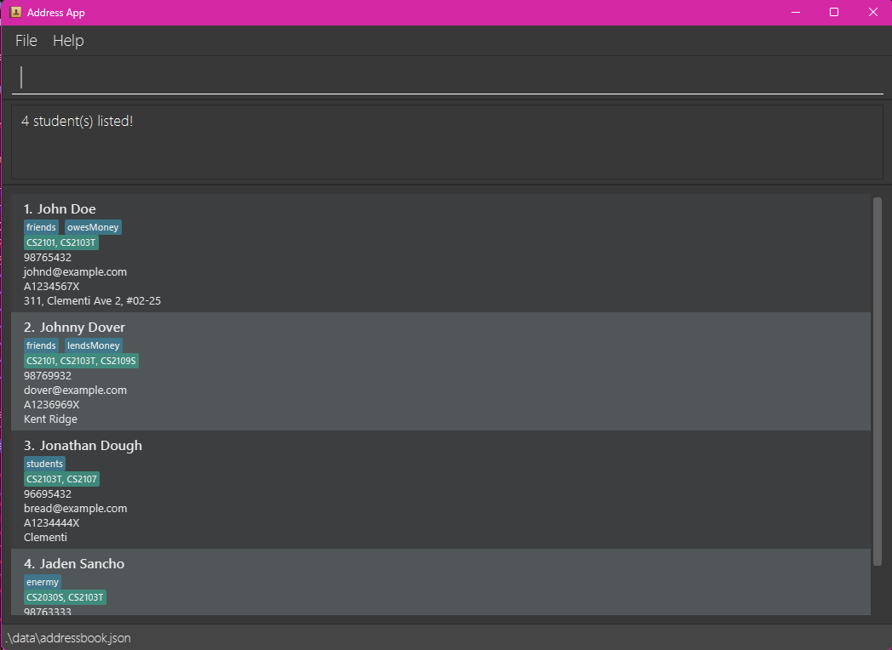

conTAct **is a desktop app designed to help Teaching Assistants efficiently manage student lists and information.** It’s optimized for fast use via the **Command Line Interface (CLI)**, while still offering the ease of a Graphical User Interface (GUI). If you're comfortable typing commands, conTAct makes tracking students, managing tutorials, and updating records quicker than traditional GUI-based apps.

* Table of Contents
{:toc}

--------------------------------------------------------------------------------------------------------------------

## Quick start

1. Ensure you have Java `17` or above installed in your Computer. You are advised to run the app using Java `17`. 
   *Refer to
   [this](https://se-education.org/guides/tutorials/javaInstallation.html) Java installation guide for more help on installing
   and switching between Java versions.* 
   **Mac users:** Ensure you have the precise JDK version prescribed [here](https://se-education.org/guides/tutorials/javaInstallationMac.html).

2. Visit conTAct's Github Releases [here](https://github.com/AY2425S2-CS2103T-F14-1/tp/releases).

3. Find the latest releases. Under "Assets", find the `.jar` file (e.g addressbookv1.4.jar). Click the `.jar` file to download it.

4. Choose or create a folder where you want to store and run conTAct. Copy the `.jar` file to this folder.

5. Open a command terminal.  
   **Windows Users:** Press `Windows + R`, type `cmd`, and hit Enter. 
   **Mac Users:** Open *Terminal* from the Launchpad or Spotlight (`Cmd + Space, then type "Terminal"). 
   **Linux Users:** Open your Terminal from the Applications menu.

6. Type `java -jar <name_of_file>.jar` in the terminal, and then Enter to run the application. 
   A GUI similar to the below should appear in a few seconds. Note how the app contains some sample data. 
   

7. Type the command in the command box and press Enter to execute it. e.g. typing **`help`** and pressing Enter will open the help window. 
   Some example commands you can try:

   * `list` : Lists all contacts.

   * `add n/John Doe p/98765432 e/johnd@example.com a/John street, block 123, #01-01` : Adds a contact named `John Doe` to conTActs.

   * `delete n/John Doe` : Deletes John Doe from the conTAct list.

   * `clear` : Deletes all contacts.

   * `exit` : Exits the app.

1. Refer to the [Features](#features) below for details of each command.

--------------------------------------------------------------------------------------------------------------------

## Features

**:information_source: Notes about the command format:** 

* Words in `UPPER_CASE` are the parameters to be supplied by the user. 
  e.g. in `add n/NAME`, `NAME` is a parameter which can be used as `add n/John Doe`.

* Items in square brackets are optional. 
  e.g `n/NAME [t/TAG]` can be used as `n/John Doe t/friend` or as `n/John Doe`.

* Items with `…`​ after them can be used multiple times including zero times. 
  e.g. `[t/TAG]…​` can be used as ` ` (i.e. 0 times), `t/friend`, `t/friend t/family` etc.

* Parameters can be in any order. 
  e.g. if the command specifies `n/NAME p/PHONE_NUMBER`, `p/PHONE_NUMBER n/NAME` is also acceptable.

* Extraneous parameters for commands that do not take in parameters (such as `help`, `exit` and `clear`) will be ignored. 
  e.g. if the command specifies `help 123`, it will be interpreted as `help`.

* If you are using a PDF version of this document, be careful when copying and pasting commands that span multiple lines as space characters surrounding line-breaks may be omitted when copied over to the application.

### Viewing help : `help`

Shows a message explaning how to access the help page.

Format: `help`

### Adding a person: `add`

Adds a student to conTAct.

Format: `add n/NAME p/PHONE_NUMBER e/EMAIL s/STUDENT_ID [te/telegram] [t/TAG]… [tut/TUTORIALS]… [a/ADDRESS]`

:bulb: **Tip:**
A student can have any number of tags (including 0) and any number of tutorials (including 0).
The address and telegram field is optional.  
Input constraints: 
- Tutorial name and tag name should be alphanumeric values. 
- Student ID should starts with an A, followed by 7 numbers and an A-Z letter. 
- Telegram should be alphanumeric values or underscores.

Examples:
* `add n/Mai p/12341234 e/student@example.com s/A1234567X`
* `add n/Mai p/12341234 e/student@example.com s/A1234567X t/needs-care`
* `add n/Mai p/12341234 e/student@example.com s/A1234567X t/needs-care tut/CS2103 tut/CS2109S`
* `add n/Mai p/12341234 e/student@example.com s/A1234567X t/needs-care tut/CS2103 tut/CS2109S a/Kent Ridge Hall`

### Listing all persons : `list`

Shows a list of all persons in conTAct. You can customize the fields displayed in the person cards using prefixes.

Format: `list [PREFIX]...`

* If no prefixes are provided, all fields will be displayed by default.
* Supported prefixes:
  * `n/` - Show name
  * `p/` - Show phone number
  * `e/` - Show email
  * `a/` - Show address
  * `s/` - Show student ID
  * `te/` - Show telegram
  * `t/` - Show tags
  * `tut/` - Show tutorials
* You can combine multiple prefixes to display specific fields.

Examples:
* `list` - Displays all persons with all fields.
* `list n/ p/` - Displays all persons with only their name and phone number.
* `list n/ e/ t/` - Displays all persons with their name, email, and tags.

### Editing a person : `edit`

Edits an existing student in conTAct.

Format: `edit INDEX [n/NAME] [p/PHONE] [e/EMAIL] [a/ADDRESS] [t/TAG]…​`

* Edits the student at the specified `INDEX`. The index refers to the index number shown in the displayed person list. The index **must be a positive integer** 1, 2, 3, …​
* At least one of the optional fields must be provided.
* Existing values will be updated to the input values.
* When editing tags, the existing tags of the person will be removed i.e adding of tags is not cumulative.
* You can remove all the person’s tags by typing `t/` without
    specifying any tags after it.

:bulb: **Tip:**
The index refers to the list currently being shown. 

Examples:
*  `edit 1 p/91234567 e/johndoe@example.com` Edits the phone number and email address of the 1st person to be `91234567` and `johndoe@example.com` respectively.
*  `edit 2 n/Betsy Crower t/` Edits the name of the 2nd person to be `Betsy Crower` and clears all existing tags.

### Locating persons by attributes: `find`

Finds persons whose fields match any of the given keywords.
Only one field is allowed in each `find`.

Format: `find PREFIX KEYWORD [MORE_KEYWORDS]`

* The search is case-insensitive. e.g., `hans` will match `Hans`.
* The order of the keywords for name does not matter. e.g., `Hans Bo` will match `Bo Hans`.
* Supported prefixes and their behavior:
  * `n/` - **Search by name**: Only full words will be matched. Partial matches are not supported.  
    Example:  
    - `find n/John` returns `John Doe` but not `Johnny` or `Jonathan`.
  * `p/` - **Search by phone number**: Partial matches are supported.  
    Example:  
    - `find p/123` returns people with phone number `12345` and `91234567`.
  * `e/` - **Search by email**: Partial matches are supported.  
    Example:  
    - `find e/example` returns people with email `example@example.com` and `test@example.com`.
  * `a/` - **Search by address**: Partial matches are supported.  
    Example:  
    - `find a/Main` returns people with address `123 Main Street` and `Main Avenue`.
  * `t/` - **Search by tags**: Only full words will be matched. Partial matches are not supported.  
    Example:  
    - `find t/friend` returns all persons tagged as `friend` but not `best-friend`.
  * `s/` - **Search by student ID**: Partial matches are supported.  
    Example:  
    - `find s/A1234567X` returns the person with student ID `A1234567X` and `A4561237E`.
  * `tut/` - **Search by tutorials**: Only full words will be matched. Partial matches are not supported.  
    Example:  
    - `find tut/CS2103T` returns all persons in the tutorial `CS2103T` but not `CS2103`.

### Deleting a person or a group of people: `delete`

Deletes students from the list based on the specified field and value.

Format: `delete PREFIX KEYWORD`

* Deletes all students whose specified field matches the given keyword.
* The search is case-insensitive. e.g., `alice` will match `Alice`.
* Supported prefixes and their behavior:
  * `n/` - **Delete by name**: Only full words will be matched. Partial matches are not supported.
    Example:  
    - `delete n/John` deletes all students with names containing `John`, such as `John Doe`, but no `Johnny`, and `Johnathan`.
    - `delete n/John Mayer` deletes the student with name `John Mayer`
  * `p/` - **Delete by phone number**: This field is not supported.
  * `e/` - **Delete by email**: Partial matches are supported.  
    Example:  
    - `delete e/example` deletes all students with emails containing `example`, such as `example@example.com` and `test@example.com`.
  * `a/` - **Delete by address**: This field is not supported.
  * `t/` - **Delete by tags**: Only full words will be matched. Partial matches are not supported.  
    Example:  
    - `delete t/friend` deletes all students tagged as `friend` but not `best-friend`.
  * `s/` - **Delete by student ID**: Only full words will be matched. Partial matches are not supported.  
    Example:  
    - `delete s/A1234567X` deletes the student with the exact student ID `A1234567X`.
  * `tut/` - **Delete by tutorials**: Only full words will be matched. Partial matches are not supported.  
    Example:  
    - `delete tut/CS2103T` deletes all students in the tutorial `CS2103T` but not `CS2103`.

Examples:
* `delete n/John` - Deletes all students with names containing `John`, such as `John Doe`, `Johnny`, and `Johnathan`.
* `delete t/friends` - Deletes all students tagged as `friends`.
* `delete s/A1234567X` - Deletes the student with the exact student ID `A1234567X`.
* `delete tut/CS2103T` - Deletes all students in the tutorial `CS2103T`.

### Clearing all entries : `clear`

Clears all entries from conTAct.

Format: `clear`

### Exiting the program : `exit`

Exits the program.

Format: `exit`

### Saving a current version of data : `save`

Archives a copy of the current version of the list.

Format: `save FILE_PATH`

Example:
* `save addressbook` - Saves the current version of the list as data/addressbook.json.

### Loading a copy of address book : `load`

Loads a .json copy of students list into conTAct.

Format: `load FILE_PATH`

Example: 
* `load addressbook` - Loads addressbook.json into conTAct.

### Saving the data

AddressBook data are saved in the hard disk automatically after any command that changes the data. There is no need to save manually.

### Editing the data file

AddressBook data are saved automatically as a JSON file `[JAR file location]/data/addressbook.json`. Advanced users are welcome to update data directly by editing that data file.

:exclamation: **Caution:**
If your changes to the data file makes its format invalid, AddressBook will discard all data and start with an empty data file at the next run. Hence, it is recommended to take a backup of the file before editing it. 
Furthermore, certain edits can cause the AddressBook to behave in unexpected ways (e.g., if a value entered is outside of the acceptable range). Therefore, edit the data file only if you are confident that you can update it correctly.

--------------------------------------------------------------------------------------------------------------------

## FAQ

**Q**: How do I transfer my data to another Computer? 
**A**: Install the app in the other computer and overwrite the empty data file it creates with the file that contains the data of your previous AddressBook home folder.

Alternatively, save a copy of your data as a `.json` file using the `save <file_name>` command. Then, send the `.json` file directly to the other Computer and load it in the 
conTAct app using the `load <file_name>` command.

--------------------------------------------------------------------------------------------------------------------

## Known issues

1. **When using multiple screens**, if you move the application to a secondary screen, and later switch to using only the primary screen, the GUI will open off-screen. The remedy is to delete the `preferences.json` file created by the application before running the application again.
2. **If you minimize the Help Window** and then run the `help` command (or use the `Help` menu, or the keyboard shortcut `F1`) again, the original Help Window will remain minimized, and no new Help Window will appear. The remedy is to manually restore the minimized Help Window.

--------------------------------------------------------------------------------------------------------------------

## Command summary

Action | Format, Examples
--------|------------------
**Add** | `add n/NAME p/PHONE_NUMBER e/EMAIL [t/TAG] [tut/TUTORIAL] [a/ADDRESS]…​`   e.g., `add n/James Ho p/22224444 e/jamesho@example.com t/friend t/colleague tut/CS2103 a/123, Clementi Rd, 1234665 `
**Clear** | `clear`
**Delete** | `delete PREFIX KEYWORD`  e.g., `delete n/John`, `delete t/friends`, `delete s/A1234567X`
**Edit** | `edit INDEX [n/NAME] [p/PHONE_NUMBER] [e/EMAIL] [t/TAG] [tut/TUTORIAL] [a/ADDRESS]…​`  e.g.,`edit 2 n/James Lee e/jameslee@example.com`
**Find** | `find PREFIX KEYWORD [MORE_KEYWORDS]`  e.g., `find n/John`, `find t/friend`, `find tut/CS2103T`
**List** | `list [PREFIX]...`  e.g., `list`, `list n/ p/`, `list n/ e/ t/`
**Save** | `save FILE_PATH`  e.g., `save addressbook`
**Load** | `load FILE_PATH`  e.g., `load addressbook`
**Help** | `help`
