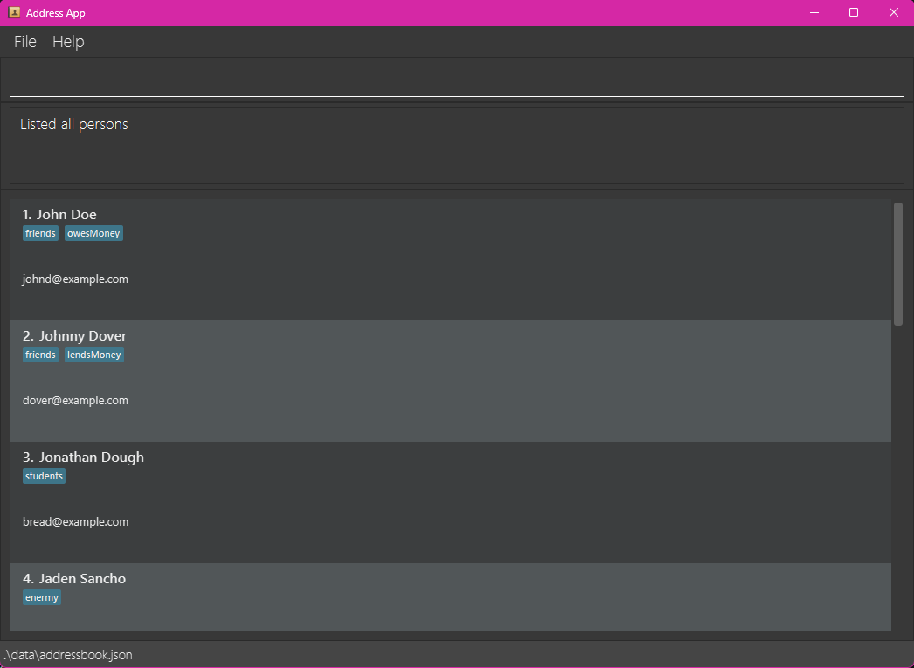

conTAct **is a desktop app designed to help Teaching Assistants efficiently manage student lists and information.** It’s optimized for fast use via the **Command Line Interface (CLI)**, while still offering the ease of a Graphical User Interface (GUI). If you're comfortable typing commands, conTAct makes tracking students, managing tutorials, and updating records quicker than traditional GUI-based apps.

* Table of Contents
{:toc}

--------------------------------------------------------------------------------------------------------------------

## Quick start

1. Ensure you have Java `17` or above installed in your Computer. You are advised to run the app using Java `17`. 
   *Refer to [this](https://se-education.org/guides/tutorials/javaInstallation.html) Java installation guide for more help on installing and switching between Java versions.* 
   **Mac users:** Ensure you have the precise JDK version prescribed [here](https://se-education.org/guides/tutorials/javaInstallationMac.html).

2. Visit conTAct's Github Releases [here](https://github.com/AY2425S2-CS2103T-F14-1/tp/releases).

3. Find the latest release. Under "Assets", find the `.jar` file (e.g conTActv1.6.jar). Click the `.jar` file to download it.

4. Choose or create a folder where you want to store and run conTAct. Copy the `.jar` file to this folder.

5. Open a command terminal.  
   **Windows Users:** Press `Windows + R`, type `cmd`, and hit Enter. 
   **Mac Users:** Open *Terminal* from the Launchpad or Spotlight (`Cmd + Space`, then type "Terminal"). 
   **Linux Users:** Open your Terminal from the Applications menu.

6. Type `java -jar <name_of_file>.jar` (e.g java -jar conTAct.jar) in the terminal, and then Enter to run the application. 
   A GUI similar to the below should appear in a few seconds.  
   

7. Type the command in the command box and press Enter to execute it. e.g. typing **`help`** and pressing Enter will open the help window. 
   Some example commands you can try:

    * `list` : Lists all contacts.
    * `add n/John Doe p/98765432 e/johnd@example.com s/A1234567X` : Adds a student named `John Doe` to conTAct.
    * `delete n/John Doe` : Deletes John Doe from the contact list.
    * `clear` : Deletes all contacts.
    * `exit` : Exits the app.

8. Refer to the [Features](#features) below for details of each command.

--------------------------------------------------------------------------------------------------------------------

## Features

**:information_source: Notes about the command format:** 

* Command words ARE case sensitive. 
  e.g. `delete` will be a valid command word but `DELETE` or `Delete` will not be accepted.

* Prefixes ARE case sensitive. 
 e.g. `/n` will be a valid prefix but `/N` will not be accepted.

* Words in `UPPER_CASE` are the parameters to be supplied by the user. 
  e.g. in `add n/NAME`, `NAME` is a parameter which can be used as `add n/John Doe`.

* Items in square brackets are optional. 
  e.g `n/NAME [t/TAG]` can be used as `n/John Doe t/friend` or as `n/John Doe`.

* Items with `…`​ after them can be used multiple times including zero times. 
  e.g. `[t/TAG]…​` can be used as ` ` (i.e. 0 times), `t/friend`, `t/friend t/family` etc.

* Parameters can be in any order. 
  e.g. if the command specifies `n/NAME p/PHONE_NUMBER`, `p/PHONE_NUMBER n/NAME` is also acceptable.

* Student duplicates are checked using student ID. We do not check for uniqueness in other attributes such as name, email, phone number and telegram handle.

* Extraneous parameters for commands that do not take in parameters (such as `help`, `exit` and `clear`) will be ignored. 
  e.g. if the command specifies `help 123`, it will be interpreted as `help`.

* If you are using a PDF version of this document, be careful when copying and pasting commands that span multiple lines as space characters surrounding line-breaks may be omitted when copied over to the application.

### 🔹 Basic Operations

#### Viewing help : `help`

Shows a message explaining how to access the help page.

Format: `help`

---

#### Exiting the program : `exit`

Exits the program.

Format: `exit`

---

### 🟢 Managing Contacts

#### Adding a student : `add`

Format: `add n/NAME p/PHONE_NUMBER e/EMAIL s/STUDENT_ID [te/telegram] [t/TAG]... [tut/TUTORIAL]... [a/ADDRESS]`

:bulb: **Input constraints:**
- A student can have any number of tags (including 0) and any number of tutorials (including 0). 
- The address and telegram field is optional.  
- Student ID should starts with an A, followed by 7 numbers and a capital letter (A-Z). 
- Phone numbers only contain numbers, should be at least 3 digits long, and may include '+', '(', and ')' for country code. E.g: (+65)12341234. 
- Emails should be of the format <local-part>@<domain> and adhere to the following constraints: 
    1. The local-part should only contain alphanumeric characters and these special characters, excluding the parentheses, (+_.-). The local-part may not start or end with any special characters. 
    2. This is followed by a '@' and then a domain name. The domain name is made up of domain labels separated by periods. 
    The domain name must:
        2a. end with a domain label at least 2 characters long.
        2b. have each domain label start and end with alphanumeric characters
        2c. have each domain label consist of alphanumeric characters, separated only by hyphens, if any. 
- Telegram should be alphanumeric values or underscores. 
- Tutorial names and tag names should be alphanumeric values, tutorials can have hyphens. 

Examples:
* `add n/Mai p/12341234 e/student@example.com s/A1234567X`
* `add n/Mai p/12341234 e/student@example.com s/A1234567X t/leader tut/CS2103 te/mai2002`
* `add n/Mai p/12341234 e/student@example.com s/A1234567X t/leader tut/CS2103 te/mai2002 a/Kent Ridge`

---

#### Editing a student : `edit`

Edits an existing student in conTAct.

Format: `edit INDEX n/NAME p/PHONE_NUMBER e/EMAIL s/STUDENT_ID [te/telegram] [t/TAG]... [tut/TUTORIAL]... [a/ADDRESS]`

* Edits the student at the specified `INDEX`. The index refers to the index number shown in the displayed person list. The index **must be a positive integer** 1, 2, 3, …​
* At least one of the optional fields must be provided.
* Existing values will be updated to the input values.
* When editing tags, the existing tags of the person will be removed i.e adding of tags is not cumulative.
* You can remove all the person’s tags by typing `t/` without specifying any tags after it.
* You can remove all the person's tutorial by typing `tut/` without specifying any tutorials after it.
* You may edit to the exact same information as before.

:bulb: **Tip:**
The index refers to the list currently being shown. (e.g If you type `find n/John Doe` and John Doe appears on the top of the list, typing `edit 1` will edit John Doe's information)

Examples:
* `edit 1 p/91234567 e/johndoe@example.com`
* `edit 2 n/Betsy Crower t/`

---

#### Deleting a student or a group of students : `delete`

Deletes students from the list based on the specified field and value.
Only one field is allowed in each `delete`.

Format: `delete PREFIX KEYWORD`

* Deletes all students whose specified field matches the given keyword.
* The deletion is case-insensitive. e.g., `alice` will match `Alice`.
* For fields like `name` and `student ID`, all keywords must match exactly.
* You can only delete students that are displayed
**For example, if you run `find n/John Doe` and students named "John Doe" are displayed, you cannot delete "Alice" who exists in the list but is not displayed.**
* Supported prefixes and their behavior:

| Prefix | Field         | Behavior                                                                                     | Example                                                                                     |
|--------|---------------|---------------------------------------------------------------------------------------------|---------------------------------------------------------------------------------------------|
| `n/`   | Name          | Matches all keywords in the name field exactly.                                             | `delete n/John Doe` deletes `John Doe` but not `Johnny` or `Jonathan`.                     |
| `e/`   | Email         | Matches the email exactly.                                                                  | `delete e/johnd@example.com` deletes the person with email `johnd@example.com`.            |
| `t/`   | Tags          | Matches the tag exactly.                                                                    | `delete t/friend` deletes all persons tagged as `friend` but not `best-friend`.            |
| `s/`   | Student ID    | Matches the student ID exactly.                                                             | `delete s/A1234567X` deletes the person with student ID `A1234567X`.                       |
| `te/`  | Telegram      | Matches the Telegram handle exactly.                                                        | `delete tg/johndoe` deletes the person with Telegram handle `@johndoe`.                    |
| `tut/` | Tutorials     | Matches the tutorial name exactly.                                                          | `delete tut/CS2103T` deletes all persons in the tutorial `CS2103T`.                        |

Examples:
* `delete n/John` - Deletes all students with names containing `John`, such as `John Doe`, `Johnny`, and `Johnathan`.
* `delete t/friends` - Deletes all students tagged as `friends`.
* `delete s/A1234567X` - Deletes the student with the exact student ID `A1234567X`.
* `delete tut/CS2103T` - Deletes all students in the tutorial `CS2103T`.

:exclamation: **Caution:**
The action is irreversible and no confirmation will be prompted!

---

#### Clearing all entries : `clear`

Clears all entries from conTAct.

Format: `clear`

---

### 🔍 Searching & Viewing Contacts

#### Listing all students : `list`

Shows a list of all students in conTAct. You can customize the fields displayed in the person cards using prefixes.
**Note:** This command is for customizing the display of information based on the user's preference and is not meant for searching purposes. If you want to search for specific students, refer to the [`find`](#locating-students-by-attributes--find) command.

Format: `list [PREFIX]...`

* If no prefixes are provided, all fields will be displayed by default.
* Supported prefixes:
    * `n/` - Show name
    * `p/` - Show phone number
    * `e/` - Show email
    * `a/` - Show address
    * `s/` - Show student ID
    * `te/` - Show telegram
    * `t/` - Show tags
    * `tut/` - Show tutorials
* You can combine multiple prefixes to display specific fields.

Examples:
* `list` - Displays all persons with all fields.
* `list n/ p/` - Displays all persons with only their name and phone number.
* `list n/ e/ t/` - Displays all persons with their name, email, and tags.

---

#### Locating students by attributes : `find`

Finds students whose fields match any of the given keywords.  
Only one field is allowed in each `find`.

Format: `find PREFIX KEYWORD`

* The search is case-insensitive. e.g., `hans` will match `Hans`.

| Prefix | Field         | Behavior                                                                                     | Example                                                                                   |
|--------|---------------|---------------------------------------------------------------------------------------------|-------------------------------------------------------------------------------------------|
| `n/`   | Name          | Matches any keyword in the name field.                                                      | `find n/John` returns `John Doe`, `Johnny`, and `Jonathan`.                               |
| `p/`   | Phone number  | Partial matches are supported.                                                              | `find p/123` returns people with phone numbers `12345` and `91234567`.                    |
| `e/`   | Email         | Partial matches are supported.                                                              | `find e/example` returns people with emails `example@example.com` and `test@example.com`. |
| `a/`   | Address       | Partial matches are supported.                                                              | `find a/Main` returns people with addresses `123 Main Street` and `Main Avenue`.          |
| `t/`   | Tags          | Only full words will be matched. Partial matches are not supported.                         | `find t/friend` returns all persons tagged as `friend` but not `best-friend`.             |
| `s/`   | Student ID    | Partial matches are supported.                                                              | `find s/A1234567X` returns the person with student IDs `A1234567X` and `A4561237E`.       |
| `tut/` | Tutorials     | Only full words will be matched. Partial matches are not supported.                         | `find tut/CS2103T` returns all persons in the tutorial `CS2103T` but not `CS2103`.        |
| `te/`  | Telegram      | Partial matches are supported.                                                              | `find te/johndoe` returns persons with Telegram handles like `@johndoe` or `johndoexyz`.  |

---

### 📂 Data Management

#### Automatically saving the data

All data changes are saved automatically to `[JAR location]/data/addressbook.json`.

---

#### Saving the data manually : `save`

Format: `save [FILE_NAME]`

* Saves the current address book data to a specified file.
* The data will be saved in json files, which are stored in the folder `data` in the directory that contains the program's jar file.
* Please take note that if the user saves to a file that has already existed (E.g. the user previously saved to test.json and now run `save test`), the previously saved version will be replaced with the new version. Because of this, we advise users to use the `files` command to see all the saved files before saving to prevent duplicates.

Examples:
* `save backup` - Saves the data to `backup.json`.
* `save backup.json` - Saves the data to `backup.json`.

:exclamation: **Caution:**
Do not save files as "addressbook" as it will be overwritten by the data file that is automatically saved when you exit the app.

---

#### Loading data from a file : `load`

Loads data from a specified file.

Format: `load [FILE_NAME]`

* The file must be a valid JSON file containing the required field.
* If the file is not found or the format is invalid, an error message will be displayed, and the current data will remain unchanged.
* Please take note that once a saved file is loaded, the current data if not saved will be erased. Make sure to save the current data before loading if this is undesirable.

Examples:
* `load backup` - Loads data from `backup.json`.
* `load backup.json` - Loads data from `backup.json`.

---

#### Listing all saved files : `files`

Displays a list of all saved files in the application's data directory.

Format: `files`

* The command will list all files with their names and extensions.
* Files are displayed in alphabetical order.

---

### Editing the data file

conTAct data are saved automatically as a JSON file `[JAR file location]/data/addressbook.json`. Advanced users are welcome to update data directly by editing that data file.

:exclamation: **Caution:**
If your changes to the data file makes its format invalid, conTAct will discard all data and start with an empty data file at the next run. Hence, it is recommended to take a backup of the file before editing it. 
Furthermore, certain edits can cause the conTAct to behave in unexpected ways (e.g., if a value entered is outside of the acceptable range). Therefore, edit the data file only if you are confident that you can update it correctly.

--------------------------------------------------------------------------------------------------------------------

## FAQ

**Q**: How do I transfer my data to another Computer? 
**A**: Install the app in the other computer and overwrite the empty data file it creates with the file that contains the data of your previous conTAct home folder.

Alternatively, save a copy of your data as a `.json` file using the `save <file_name>` command. Then, send the `.json` file directly to the other Computer and load it in the
conTAct app using the `load <file_name>` command.

--------------------------------------------------------------------------------------------------------------------

## Known issues

1. **When using multiple screens**, if you move the application to a secondary screen, and later switch to using only the primary screen, the GUI will open off-screen. The remedy is to delete the `preferences.json` file created by the application before running the application again.
2. **If you minimize the Help Window** and then run the `help` command (or use the `Help` menu, or the keyboard shortcut `F1`) again, the original Help Window will remain minimized, and no new Help Window will appear. The remedy is to manually restore the minimized Help Window.

--------------------------------------------------------------------------------------------------------------------

## Command summary

Action | Format, Examples
--------|------------------
**Add** | `add n/NAME p/PHONE_NUMBER e/EMAIL [te/TELEGRAM] [t/TAG] [tut/TUTORIAL] [a/ADDRESS]…​`   e.g., `add n/James Ho p/22224444 e/jamesho@example.com te/jameshuai t/friend t/colleague tut/CS2103 a/123, Clementi Rd, 1234665 `
**Clear** | `clear`
**Delete** | `delete PREFIX KEYWORD`  e.g., `delete n/John`, `delete t/friends`, `delete s/A1234567X`
**Edit** | `edit INDEX [n/NAME] [p/PHONE_NUMBER] [e/EMAIL] [t/TAG] [tut/TUTORIAL] [a/ADDRESS]…​`  e.g.,`edit 2 n/James Lee e/jameslee@example.com`
**Find** | `find PREFIX KEYWORD`  e.g., `find n/John`, `find t/friend`, `find tut/CS2103T`
**List** | `list [PREFIX]...`  e.g., `list`, `list n/ p/`, `list n/ e/ t/`
**Save** | `save FILE_PATH`  e.g., `save test`
**Load** | `load FILE_PATH`  e.g., `load test`
**Files**| `files`
**Help** | `help`

